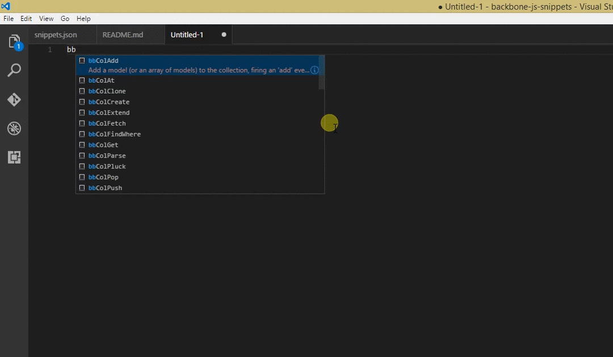

# Backbone JS Snippets

A snippet collection to save you time while coding or researching documentation when working with Backbone Js.

## Features

This snippet collection has over 50 code snippets available.

Every snippet is well documented from the official Backbone documentation (http://backbonejs.org). 

So instead of looking it up on google or backbone website (or even directly in Backbone lib), you can just type 'bb' in your js file, choose the snippet you want to research and click the info icon.

## Release Notes 

### 1.0.0

Initial release of 51 documented Backbone code snippets.

-----------------------------------------------------------------------------------------------------------
| Type  | Snippet  |
|---|---|
| Event  | on  |
| Event  | off  |
| Event  | trigger  |
| Event  | once  |
| Event  | listenTo  |
|---|---|
| Model  | extend  |
| Model  | get  |
| Model  | escape  |
| Model  | set  |
| Model  | unset  |
| Model  | clear  |
| Model  | has  |
| Model  | destroy  |
| Model  | attributes  |
| Model  | changed  |
| Model  | toJSON  |
| Model  | sync  |
| Model  | fetch  |
| Model  | changed attributes  |
| Model  | previous  |
| Model  | previous attributes  |
|---|---|
| Collection  | extend  |
| Collection  | model  |
| Collection  | sync  |
| Collection  | add  |
| Collection  | get  |
| Collection  | at  |
| Collection  | push  |
| Collection  | remove  |
| Collection  | set  |
| Collection  | pop  |
| Collection  | unshift  |
| Collection  | shift  |
| Collection  | slice  |
| Collection  | sort  |
| Collection  | pluck  |
| Collection  | where  |
| Collection  | find where  |
| Collection  | url  |
| Collection  | parse  |
| Collection  | clone  |
| Collection  | fetch  |
| Collection  | create  |
|---|---|
| View  | extend  |
| View  | remove  |
|---|---|
| Router  | extend  |
| Router  | route  |
| Router  | navigate  |
| Router  | execute  |
|---|---|
| History  | start  |
|---|---|

### For more information

* [Github page](https://github.com/IoanaApetrei/BackboneSnippets)

**Enjoy!**